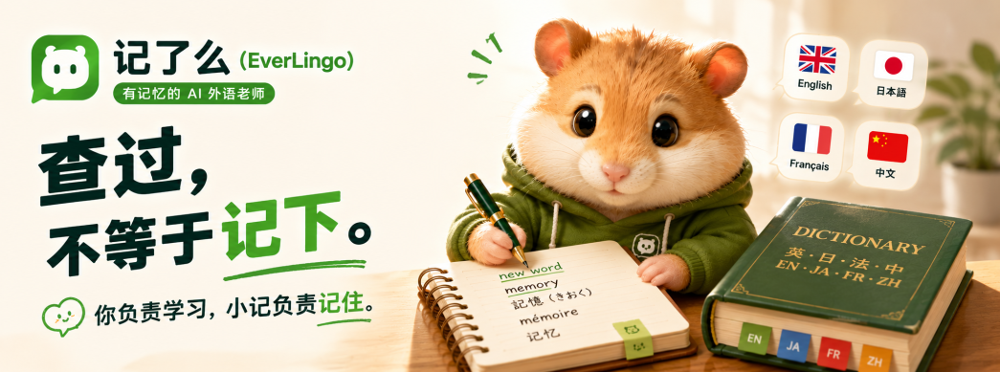
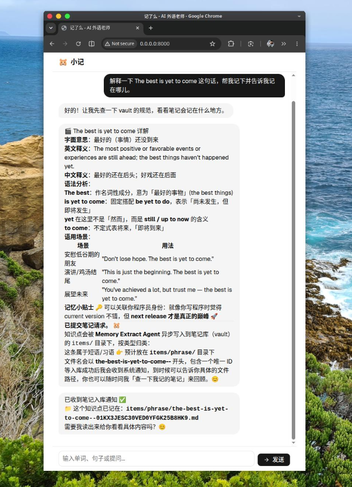
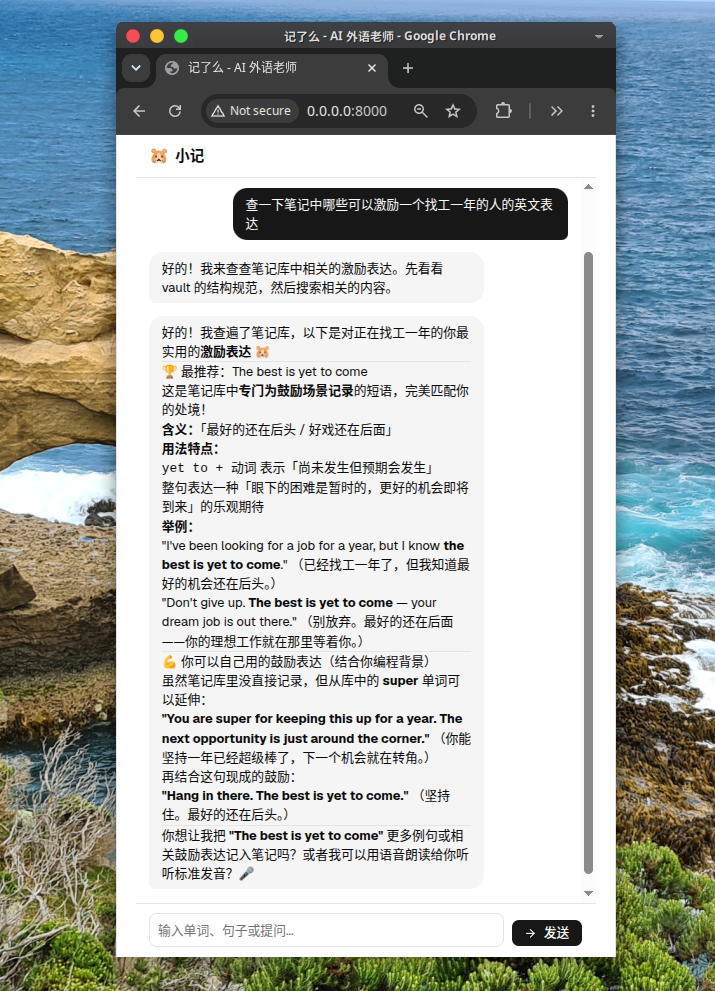
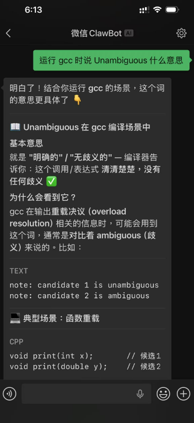
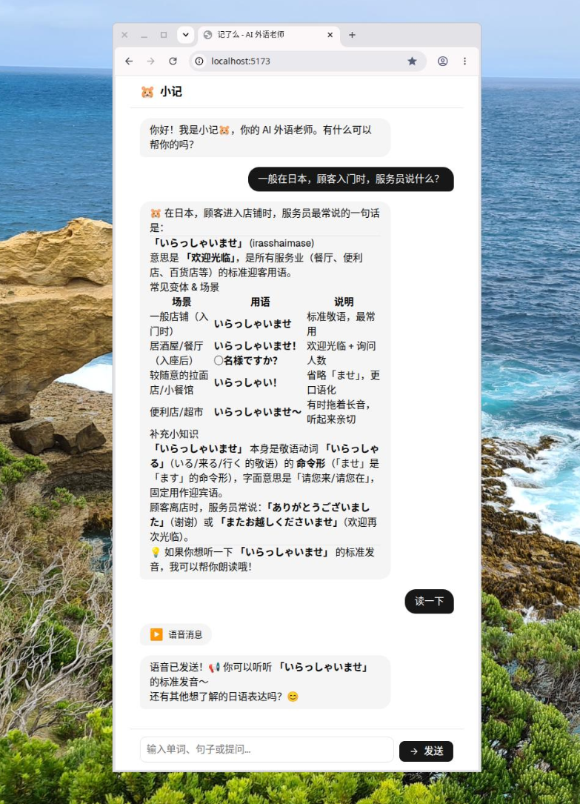
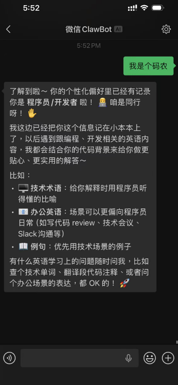
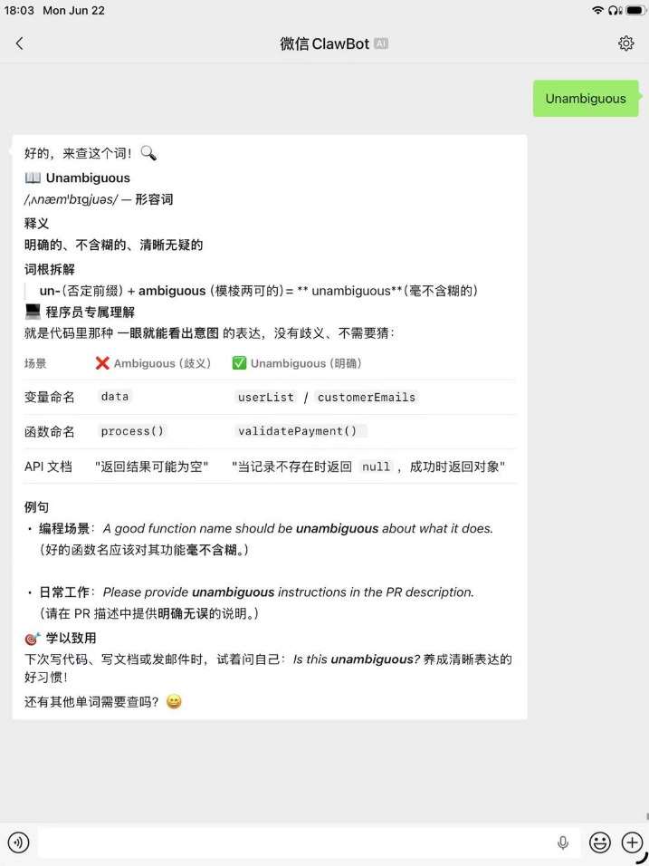
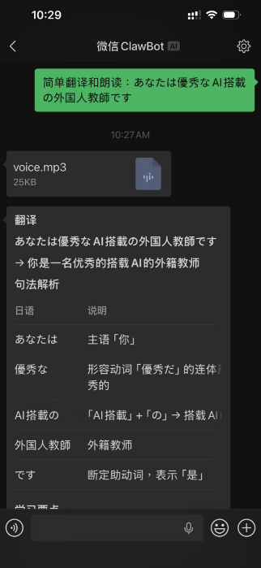
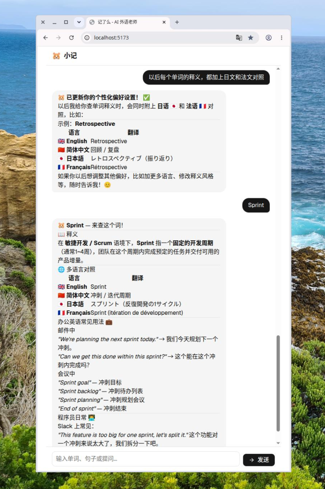

# 记了么：一个有记忆的 AI 外语老师

无论是学习外语的学生🐤，还是职场中要使用外语的🐮🐴。都面对一个问题：

**外语学习需要记录和整理，但没有人喜欢记录**

你是不是也有这样的经历：


同一个单词查了三次、五次，每次都觉得"这次应该记住了"，结果下次遇到还是一脸茫然。

AI 词典秒回你的问题，翻译工具随叫随到，但它们都有一个共同的问题——**每次对话结束，它们就把你忘了。**

你下次再来问同一个词，它还是从头给你解释一遍，好像你们从没认识过。

**查过，不等于记下。**

记了么（EverLingo）想解决的就是这个问题。

---

## 记了么是什么

一句话：**有记忆的 AI 外语老师。**

它不是又一个 AI 词典，也不是翻译工具。它是一个会在你查词、翻译、提问的过程中，**随时记录你的学习场景**，AI 整理成笔记，并在未来帮你复习和巩固的 AI 学习伙伴。可类比为养一个专为外语学习优化的 OpenClaw 龙虾🦞。你也可以养一个外教🐹。

它的吉祥物是一只仓鼠🐹，叫**小记**——善于储存，帮你积累。

> 你负责学习，小记负责记住。







---

## 已经能做什么

### 你所查的，整理成 wiki

外语学习需要记录和整理，但没有人喜欢这些。记了么在你查询时自动帮你把结果整理成 wiki 。可查可改可浏览。

Wiki Vault 是一堆 markdown 文件和目录。文件格式兼容 [Open Knowledge Format (OKF)](https://github.com/GoogleCloudPlatform/knowledge-catalog/blob/main/okf/SPEC.md) 开放标准 。wiki 的维护方法类似于 Andrej Karpathy 的 [LLM Wiki](https://gist.github.com/karpathy/442a6bf555914893e9891c11519de94f) 。AI 负责根据用户的想法，维护知识库文件。用户在自然沟通中轻松记录和笔记，避免了繁琐且容易出错的人工维护。

### 像聊天一样学外语

记了么的核心是一个对话式 Chatbot。你不需要学任何新工具——直接问就行。

查词、翻译、语法疑问、表达方式对比，都可以直接跟小记聊。它会根据你的语言水平和背景，给你**适合你的解释**，而不是千篇一律的词典释义。

比如你是程序员，它会用技术场景来解释词义；你做商务，它会优先给你商务场景的例句。还可以朗读发音🔊 。





### 越用越懂你

这是记了么最核心的特性。

小记会在对话中**动态学习你的偏好**。你可以直接告诉它："我是做后端开发的，主要看技术文档"，或者"我希望释义时多给词源解释"，它会记住这些偏好，并在之后的每一次回答中体现出来。

这些偏好存储在一个叫 `USER.md` 的文件里，你可以自己编辑，也可以让小记帮你更新。它会被实时注入到 AI 的回答逻辑中，不需要重启，不需要重新配置。

**不是你在适应工具，是工具在适应你。**





### 手机微信直接用

**不需要装 App，微信随时使用**。

扫个码，把小记接入你的[微信 ClawBot](https://cloud.tencent.com/developer/article/2651968)。之后在微信里直接跟它聊就行，就像跟朋友发消息一样。通勤路上、等咖啡的时候，随时问一句，随时学一点。支持语音输入🎙️和朗读发音🔊



### 网页和终端也能用

如果你更喜欢在电脑前学习，记了么提供了 Web 网页界面和终端 TUI 两种接入方式。

- **Web 界面**：一个干净的聊天对话框，支持 Markdown 渲染，代码、表格、列表都能清晰展示。
- **终端 TUI**：程序员友好，在命令行里直接跟小记对话。




  

### 自主的笔记财产

就算某天不用 EverLingo 了，笔记财产还有价值。

双层可移植保障的笔记：

1. 兼容 [Open Knowledge Format (OKF)](https://github.com/GoogleCloudPlatform/knowledge-catalog/blob/main/okf/SPEC.md) 开放标准的笔记，符合 [LLM Wiki](https://gist.github.com/karpathy/442a6bf555914893e9891c11519de94f) 的设计哲学。让 LLM 快速学习笔记规范。

2. 为所有 AI 应用提供了标准 MCP 接口笔记访问接口。让任何 AI Agent 无代码快速接入笔记库。


### 多语言支持

目前已支持 **英语、日本語、法语、德语** 四种目标学习语言，界面语言同样支持中文、英文等多语种切换。后续还会持续扩展。


---

## 正在路上

以下是规划中、正在开发或即将开发的功能：


### 科学复习与自动强化

这是记了么的下一个重点。

系统会自动识别你反复查询的单词、容易遗忘的表达、长期未复习的知识点，然后基于遗忘曲线和间隔重复原理，**在最合适的时间主动推送复习内容**。

不再需要你自己维护一个永远不会看的生词本。

### 浏览器插件：查询即记录

划词、查词、翻译、网页阅读一体化。浏览英文网页时，看到不懂的词直接划一下，小记自动记录这个查询的上下文——你在看哪篇文章、哪个段落、前后文是什么。

**让阅读过程本身变成学习素材。**

### iPhone 实时翻译集成

在手机界面中选词，查询、翻译。小记帮你翻译并记住。

### 更丰富的学习档案

系统会逐步构建你的个人学习档案：掌握程度曲线、薄弱知识点图谱、学习时长统计等，让你清楚看到自己的进步。

---

## 总结

市面上不缺 AI 词典，不缺 AI 翻译，甚至不缺 AI 外教。

缺的是一个**记得住你的 AI 老师**。

记了么现在还在早期阶段，很多功能还在路上。但它的核心理念已经跑通了：**把查询行为本身变成学习资产。**

如果你也在学外语，如果你也受够了查了又忘、忘了又查的循环，欢迎来试试。

也欢迎给项目提 Issue、提 PR，一起把它做得更好。


最后的最后，我想说说为什么有这个项目：

- 我本人是一个无论前职场中，还是技术学习中均要使用外语的🐮🐴。深知记忆场景化和知识整理的重要性
- 我认为我家的初中的娃需要，最少，是一个错题集和对错误的分类。然后可以复盘加强练习。而这些都是 AI 胜任的。
- 我想练手 基于 Langchain 的 AI Agent 开发。 并且，可以实战 Coding agent 去开发项目。有句话，你不会构造它，表示你不完全了解它。这对于一个刚在这个技术巨变期间失业一年的人，很重要。


最后的最后的最后，如果你觉得这开源项目 https://github.com/labilezhu/everlingo 将来有点用，记得给它打个小星星⭐。谢谢大家🤗！


## Quick Start

### 源码运行

Everlingo 是个分体式应用，包括两个进程：

- Vault MCP Server(Indexer) : 知识库维护 MCP 服务，同时还是内容索引和搜索服务
- Gateway : Everlingo 的用户接入端。提供各种 Channel 让用户接入。


以后会有一个统一的管理进程去启动和管理他们。现在先麻烦大家手工启动了 ：） 

#### Vault MCP Server(Indexer)

```bash
export OPENAI_API_KEY=sk-xxxxf98300
export OPENAI_BASE_URL=https://openrouter.ai/api/v1 
export OPENAI_MODEL=deepseek/deepseek-v4-flash
# Embedding 模型
OPENAI_EMBEDDING_MODEL=qwen/qwen3-embedding-8b

uv run python -m everlingo mem indexer start
```


#### Gateway


TUI:
```bash
export OPENAI_API_KEY=sk-xxxxf98300
export OPENAI_BASE_URL=https://openrouter.ai/api/v1 
export OPENAI_MODEL=deepseek/deepseek-v4-flash
# Embedding 模型
OPENAI_EMBEDDING_MODEL=qwen/qwen3-embedding-8b

uv run python -m everlingo.main
# or
uv run python -m everlingo.gateway.gateway --channel_stdio
```

微信:
```bash
uv run python -m everlingo.gateway.gateway --channel_wechat
```

```log
当前配置 — 界面语言: 简体中文, 目标学习语言: 日本語
[wechatbot] Scan this URL in WeChat: https://liteapp.weixin.qq.com/q/7Giu1?qrcode=b0e7e2xxx&bot_type=3
[wechatbot] Login confirmed
[wechatbot] Logged in as o9cq80y@im.wechat
[wechatbot] Long-poll started
```

#### 运行 Web 服务

两个终端：
终端 1 — 后端（FastAPI + uvicorn）

```bash
.venv/bin/python -m everlingo.gateway.gateway --channel_web
```
启动后监听 http://localhost:8000，提供 API 和静态文件。

终端 2 — 前端开发（Vite 热更新）
```bash
cd web && npm run dev
```
启动后监听 http://localhost:5173，/api/* 自动代理到后端 8000 端口。

如使用 http://localhost:8000 访问，如前端代码有变更，还需在启动 gateway 前:
```bash
pushd web
rm -rf dist
npm install          # 若 node_modules 缺失/版本变化
npm run build        # tsc && vite build → 重新生成 dist/
popd
```
构建一次，FastAPI 自动从 web/dist/ 提供前端文件。后端进程启动后，直接访问 http://localhost:8000 即可。


## 开发

对于开发者朋友，简单说一下架构。

记了么是一个 **Python 开源项目**，基于 **LangChain + LLM** 构建。核心设计思路：

- **Gateway 架构**：一个独立的 Gateway 进程管理多个 Session，每个 Session 绑定一个 Channel（微信/Web/终端）和一个 Agent。新连接进来时自动创建或恢复 Session。
- **Agent 驱动**：用户意图由 LLM Agent 自主判断，而不是硬编码路由。Agent 的 system prompt 会根据用户配置和偏好笔记动态刷新——配置改了，下一次对话立刻生效。
- **个性化注入**：用户的偏好（`USER.md`）以 Markdown 自由文本的形式存在，动态注入 Agent 的 system prompt。
- LLM tools: 文件转语音 Edge TTS
- [微信 ClawBot](https://cloud.tencent.com/developer/article/2651968) 接入


技术栈：

后端：Python + LangChain + FastAPI（后端）

Web 前端：React + Vite + TailwindCSS + shadcn/ui

微信 ClawBot 前端：微信 iLink 协议


开发使用了 Opencode 生成代码，但我永远要用 design spec 控制架构和对修改做 code review。完善的 design spec 文档可以让你的 coding agent 快速参与到这个项目。


## 文档

文档说明：

- [产品文档](./PRODUCT-FUNC.md)
- [领域模型](./DOMAIN.md)
- [架构设计](./ARCHITECTURE.md)
- [ROADMAP](ROADMAP.md)
- [项目状态](./STATE.md)
- [当前开发任务](./TASKS.md)