<p align="center">
  <a href="README.md">English</a> ·
  <a href="README.zh-CN.md">简体中文</a>
</p>

# EverLingo: An AI Language Companion That Remembers

Whether you're a student learning a foreign language or a working professional who needs to use a foreign language and remember domain-specific terminology, you face the same problem:

> Learning a language requires recording and organizing knowledge, but people are naturally bad at keeping up with it.

You may look up the same word or term n times, thinking, "I'll remember it this time." Then you encounter it again and have to start from scratch.


Traditional dictionaries and translation tools have a few limitations:

- They tend to give you generic answers. Domain-specific information that matters to you may be missing, or buried under information you have to filter out.
- They leave it up to you to capture and organize the knowledge you actually want to keep.
- When you ask about the same thing again, they usually have no idea what you learned last time.


**EverLingo** addresses this gap by turning your learning interactions into contextual notes — building a personal knowledge base that your AI language companion can use again later.

> **Learn in context. Make your notes work for you.** 🐹

---

## What is EverLingo?

In one sentence: **An AI language companion with memory.**

EverLingo is an AI language companion that **captures your learning context as you learn**. When you look up a word, translate a sentence, or ask a question, Nori 🐹 can turn that moment into a useful note — including the context in which you learned it. Later, those notes can be recalled when they are relevant, helping you strengthen your memory instead of starting from scratch again.

Think of it as an OpenClaw lobster 🦞 optimized for language learning — or simply your own little AI learning companion 🐹.


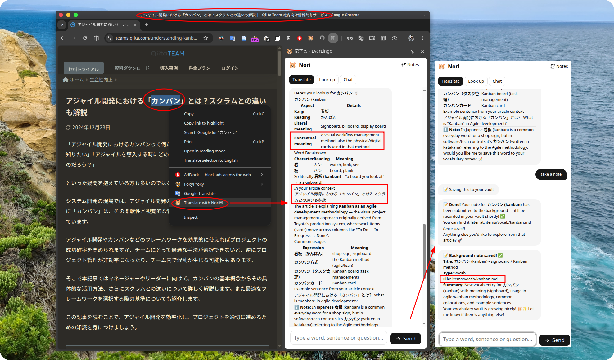

*Figure: Capturing notes with the browser extension*


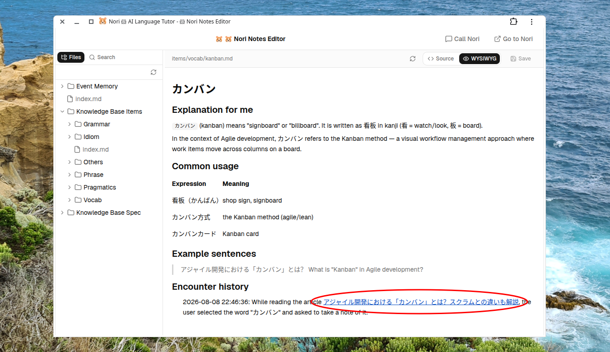

*Figure: A note-taking scenario*


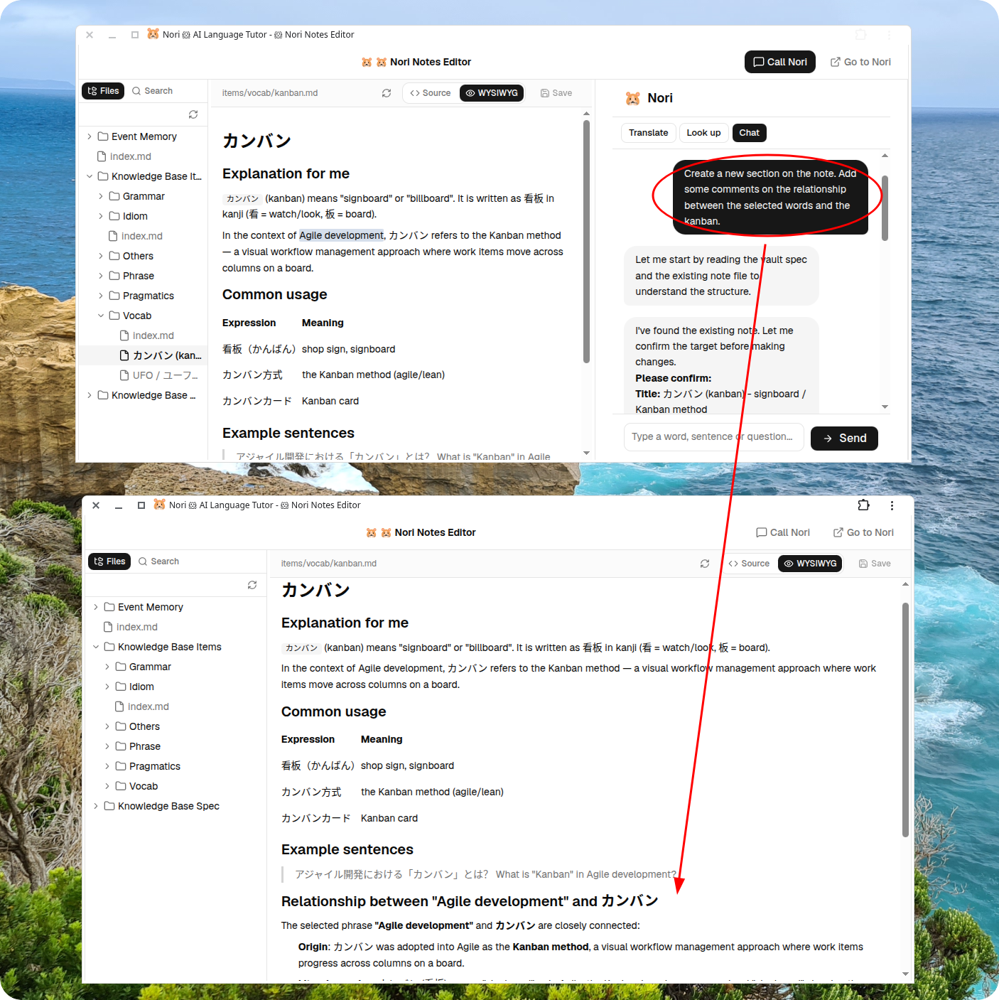

*Figure: AI-assisted note editing and human-AI "vibe noting"*


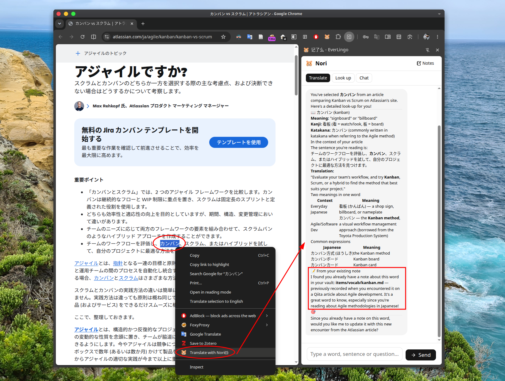

*Figure: Bringing your accumulated notes back to life*


*Figure: AI note-taking through chat on mobile*


---

## Features

-  Turn what you look up into useful notes

-  Learn through conversation

- Know your preferences. Deliver knowledge that fits you

- Multiple ways to access

- Your notes are yours

- Multilingual support


### Learn through conversation

The core of EverLingo is a conversational chatbot Nori 🐹. Just ask.

You can chat with Nori about word lookups, translations, grammar questions, and differences between expressions. 

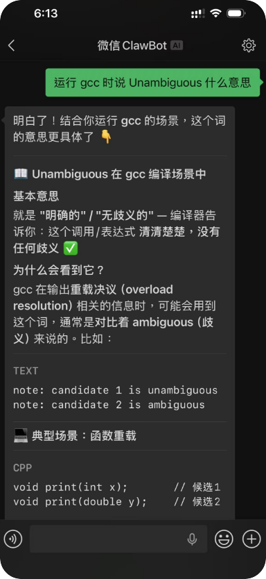

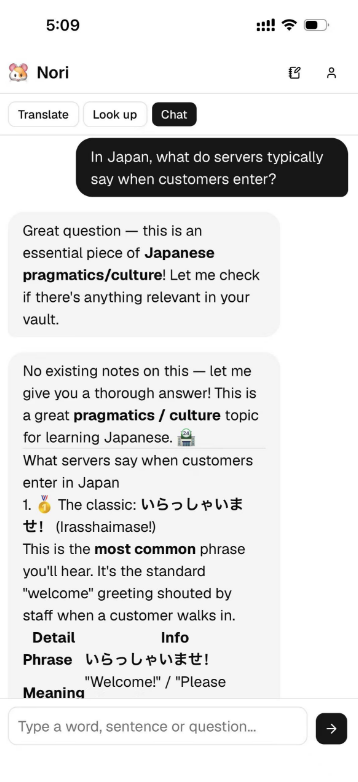

### Know your preferences. Deliver knowledge that fits you

This is one of EverLingo's core ideas.

Nori **dynamically learns your preferences** during conversations. You can simply tell it, "I'm a backend developer and mainly read technical documentation," or "I'd like more etymology when you explain words." It remembers these preferences and reflects them in future responses.

These preferences are stored in a file called `USER.md`. You can edit it yourself or ask Nori to update it.

It gives you explanations **tailored to your language level and background**, rather than one-size-fits-all dictionary definitions.

For example, if you're a programmer, it can explain a word in a technical context; if you work in business, it can prioritize business-oriented example sentences. It can also read pronunciations aloud 🔊.

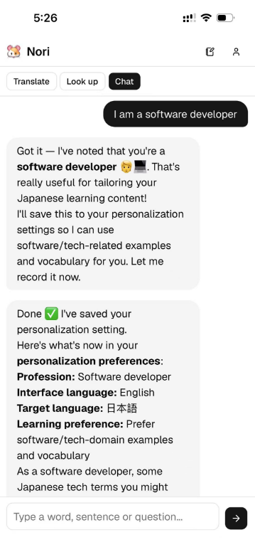


### Turn what you look up into useful notes

Language learning — especially learning terminology in a specialized domain — creates a lot of knowledge worth keeping. The problem is that taking and maintaining notes is tedious.

EverLingo helps you capture useful notes while you are learning. Nori 🐹 can organize lookup results together with your own additions, preserving the **learning context** behind each note. You can search, edit, and browse your notes, while AI helps maintain the knowledge base through natural conversation.

That context is not just stored for later. When a related topic comes up again, Nori can **recall the relevant notes and bring the original learning context back into the conversation**.

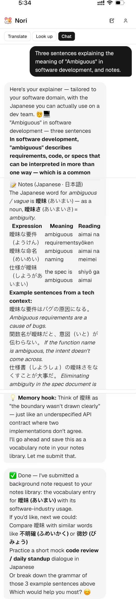

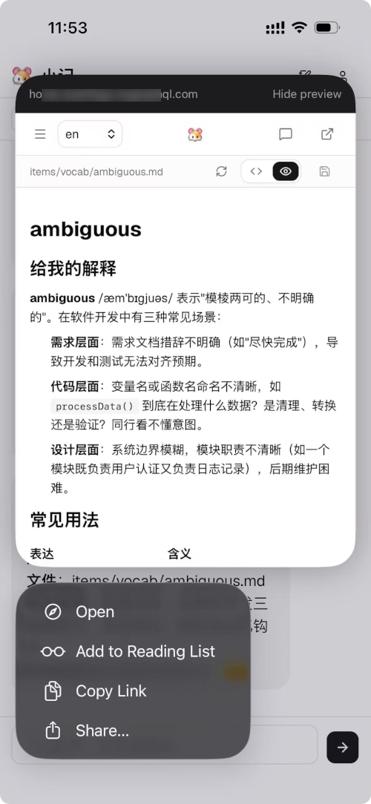


#### Browser extension: Look it up, and the context is captured

The browser extension brings word selection, dictionary lookup, translation, and web reading together. When reading an webpage, select an unfamiliar word and Nori can capture the context of that lookup — which article you were reading, which paragraph, and what was being discussed around it.

**Turn the reading process itself into learning material.**


### Bring your notes to life


*Figure: Bringing your accumulated notes back to life*

### Multiple ways to access

- Mobile web app (PWA), which can be added to your phone's home screen
- Desktop web / mobile web
- Desktop browser extension for capturing web content
- Desktop terminal
- WeChat
- WhatsApp(Coming soon)
- Telegram(Coming soon)


#### Web and terminal

If you prefer learning at your computer, EverLingo provides both a Web interface and a terminal TUI.

- **Web interface**: A clean chat interface with Markdown rendering, clearly displaying code, tables, and lists.
- **Terminal TUI**: Programmer-friendly; chat with Nori directly from the command line.

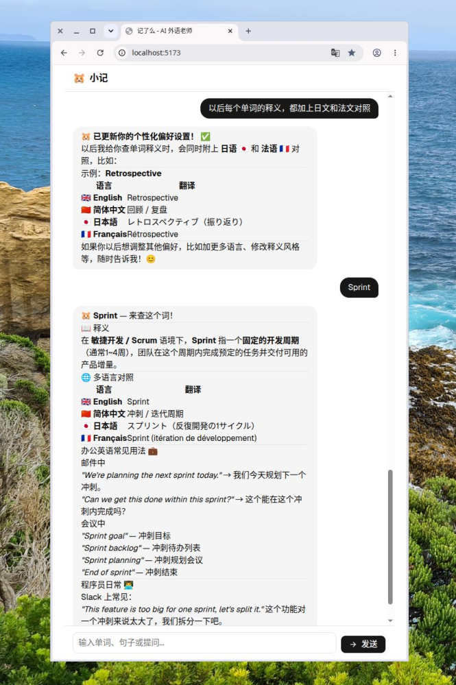


#### WeChat

No public IP or public server is required. Self-host EverLingo, scan a QR code, and connect Nori to your [WeChat ClawBot](https://cloud.tencent.com/developer/article/2651968). Then simply chat with it in WeChat, just like messaging a friend. Ask a question and learn something while commuting or waiting for coffee. Voice input 🎙️ and pronunciation playback 🔊 are supported.


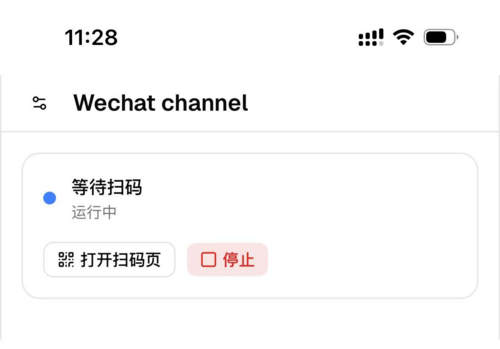

WeChat integration — scan a QR code; no public internet resources required.

### Your notes are yours

Even if you stop using EverLingo someday, your notes still have value.

Your notes have two layers of portability:

1. Notes are compatible with the open [Open Knowledge Format (OKF)](https://github.com/GoogleCloudPlatform/knowledge-catalog/blob/main/okf/SPEC.md) standard and follow the design philosophy of Andrej Karpathy's [LLM Wiki](https://gist.github.com/karpathy/442a6bf555914893e9891c11519de94f). This helps LLMs quickly learn the note structure. The notes are also compatible with Markdown editors such as Obsidian.

2. EverLingo provides a standard MCP interface for note access, allowing any AI application to connect to your note library without writing integration code.


Note export/download and GitHub synchronization are planned.


### Multilingual support

EverLingo currently supports **English, Simplified Chinese, Japanese, French, and German** as target learning languages. The interface can also be switched between English and Chinese. More languages will continue to be added.


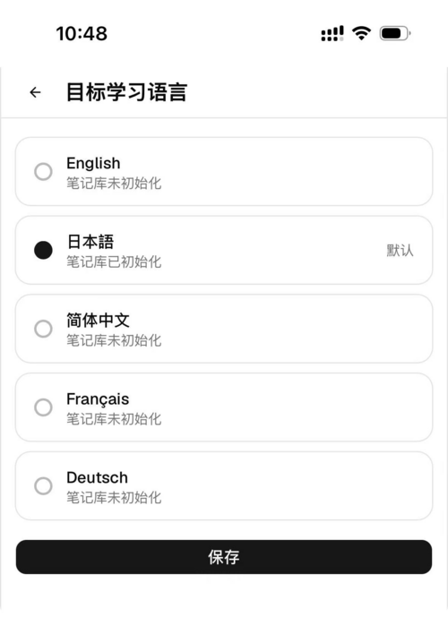


---

## Coming soon

The following features are planned, under development, or coming soon:


### Spaced repetition and automatic review

This is EverLingo's next major focus.

The system will automatically identify words you repeatedly look up, expressions you tend to forget, and knowledge you have not reviewed for a long time. Based on the forgetting curve and spaced repetition, it will **actively push review content at the right time**.

No more maintaining a vocabulary list that you never actually look at.

### iPhone real-time translation integration

Select a word on your phone to look it up and translate it. Nori will translate it and remember it for you.

### A richer learning profile

The system will gradually build your personal learning profile: mastery curves, a map of weak areas, learning-time statistics, and more, so you can clearly see your progress.


---

## Summary

There is no shortage of AI dictionaries, AI translators, or AI language companions.

What is missing is a learning companion that **remembers the context in which you learned** and can bring it back when you need it.

EverLingo is still in its early stage, and many features are still on the way. But the core idea is simple: **capture the context while you learn, then recall it when it can strengthen your memory.**

If you're learning a foreign language and are tired of the cycle of looking something up, forgetting it, and looking it up again, give EverLingo a try.

Issues and PRs are also welcome — let's make it better together.


Finally, here's why I started this project:

- I am a office worker who needs to use foreign languages both in my professional work and when learning technology. I know firsthand how important contextualized memory and knowledge organization are.
- I believe my middle-school-aged kid needs, at the very least, an error notebook and a way to classify mistakes, so they can review them and practice more effectively. These are things AI is well suited to help with.
- I wanted hands-on experience developing AI Agents with LangChain, and I also wanted to use Coding Agents to build a real project. There's a saying: if you cannot build it, you don't fully understand it. That matters a lot to someone who has been out of work for a year during a period of rapid technological change.


Finally, if you think this open-source project https://github.com/labilezhu/everlingo might be useful someday, please give it a little star ⭐. Thank you! 🤗


## Quick Start

Currently supports amd64 (Linux/Windows WSL PCs) and arm64 (Linux containers on M-series Macs / Raspberry Pi).

I have personally tested it on amd64 Linux and arm64 Raspberry Pi.


### Quick Docker setup

```bash
export HOST_WS_DIR=<your path to save workspace>

export OPENAI_API_KEY=<your key>
export OPENAI_BASE_URL=https://openrouter.ai/api/v1 # OpenAI-compatible base URL
export OPENAI_MODEL=deepseek/deepseek-v4-flash # LLM
export OPENAI_EMBEDDING_MODEL=baai/bge-m3 # Model for semantic search

export EVERLINGO_PUBLIC_BASE_URL=http://your_host_ip:8000 # Address that can reach the running EverLingo instance. Used for note links in chat messages.
export target_language=en # Target learning language: en/ja/zh-CN/fr/de

export EVERLINGO_VER=0.1.1-rc.7

mkdir -p ${HOST_WS_DIR}
cd $HOST_WS_DIR

cat >${HOST_WS_DIR}/everlingo.yaml << EOF
sys_setting:
  openai_api_key: "$OPENAI_API_KEY"
  openai_base_url: $OPENAI_BASE_URL
  openai_model: $OPENAI_MODEL
  openai_embedding_model: $OPENAI_EMBEDDING_MODEL
  logging_setting:
    log_file: ''
    log_level: debug
user_profile:
  language:
    interface_language: ''
    target_language: ${target_language} # Default target learning language is English

plugins:
  channels:
    channel_web: # Web Session Acceptor configuration
      listener: # Listen address
        port: 8000 # Default: 8000
        interface: 0.0.0.0  # Default: localhost
      public_address: # Browser access address, e.g. when accessed through the internet or an HTTPS reverse proxy
        base_url: $EVERLINGO_PUBLIC_BASE_URL
EOF

WORKSPLACE_IMAGE=ghcr.io/labilezhu/everlingo:${EVERLINGO_VER}
docker run --rm -d \
  -p 8000:8000 \
  -v ${HOST_WS_DIR}:/home/everlingo/.everlingo/workspaces/default \
  --name everlingo -h everlingo \
  ${WORKSPLACE_IMAGE}
```


### Multi-user and authentication deployment

See: [User Authentication and Multi-user Deployment](user-docs/deployment/multiple-user-auth-deployment.md)


## Development

For developers, here's a brief overview of the architecture.

EverLingo is an **open-source Python project** built with **LangChain + LLM**. Its core design ideas are:

- **Gateway architecture**: A standalone Gateway process manages multiple Sessions. Each Session is bound to a Channel (WeChat/Web/terminal) and an Agent. A new connection automatically creates or restores a Session.
- **Agent-driven**: User intent is determined autonomously by the LLM Agent rather than hard-coded routing. The Agent's system prompt is dynamically refreshed based on user configuration and preference notes — once configuration changes, the next conversation immediately uses the new settings.
- **Personalized injection**: User preferences (`USER.md`) are stored as free-form Markdown and dynamically injected into the Agent's system prompt.
- LLM tools: text-to-speech via Edge TTS
- [WeChat ClawBot](https://cloud.tencent.com/developer/article/2651968) integration


Tech stack:

Backend: Python + LangChain + FastAPI

Web frontend: React + Vite + TailwindCSS + shadcn/ui

WeChat ClawBot frontend: WeChat iLink protocol


The project uses Opencode to generate code, but I always use design specs to control the architecture and conduct code reviews for changes. A well-developed design spec allows your Coding Agent to participate in the project quickly.


### Run from source

EverLingo is a split application consisting of two processes:

- Vault MCP Server (Indexer): MCP service for maintaining the knowledge base, as well as content indexing and search
- Gateway: EverLingo's user access layer, providing multiple Channels for users to connect.


A unified management process will eventually start and manage both of them. For now, they need to be started manually. :)

#### Vault MCP Server (Indexer)

```bash
export OPENAI_API_KEY=sk-xxxxf98300
export OPENAI_BASE_URL=https://openrouter.ai/api/v1 
export OPENAI_MODEL=deepseek/deepseek-v4-flash
# Embedding model
OPENAI_EMBEDDING_MODEL=baai/bge-m3

uv run python -m everlingo mem indexer start
```


#### Gateway

##### TUI

```bash
export OPENAI_API_KEY=sk-xxxxf98300
export OPENAI_BASE_URL=https://openrouter.ai/api/v1 
export OPENAI_MODEL=deepseek/deepseek-v4-flash
# Embedding model
OPENAI_EMBEDDING_MODEL=baai/bge-m3

uv run python -m everlingo.main
# or
uv run python -m everlingo.gateway.gateway --channel_stdio
```

##### WeChat

```bash
uv run python -m everlingo.gateway.gateway --channel_wechat
```

```log
Current configuration — Interface language: Simplified Chinese, Target learning language: Japanese
[wechatbot] Scan this URL in WeChat: https://liteapp.weixin.qq.com/q/7Giu1?qrcode=b0e7e2xxx&bot_type=3
[wechatbot] Login confirmed
[wechatbot] Logged in as o9cq80y@im.wechat
[wechatbot] Long-poll started
```

##### Web

Two terminals:

Terminal 1 — backend (FastAPI + uvicorn)

```bash
.venv/bin/python -m everlingo.gateway.gateway --channel_web
```

Once started, it listens on http://localhost:8000 and provides the API and static files.

Terminal 2 — frontend development (Vite hot reload)

```bash
cd web && npm run dev
```

Once started, it listens on http://localhost:5173, with `/api/*` automatically proxied to backend port 8000.

If you access the application at http://localhost:8000, and the frontend code has changed, run the following before starting the Gateway:

```bash
pushd web
rm -rf dist
npm install          # If node_modules is missing or the version has changed
npm run build        # tsc && vite build → regenerate dist/
popd
```

After building once, FastAPI automatically serves the frontend files from `web/dist/`. Once the backend process is running, simply open http://localhost:8000.

##### Chrome Extension

```bash
# Build the extension
cd extension
npm run build # Output: extension/dist/

# Load the extension:
# Chrome → chrome://extensions → enable "Developer mode" → "Load unpacked"
# Select the extension/dist directory
```


## Documentation

Documentation:

- [Product Documentation](./PRODUCT-FUNC.md)
- [Domain Model](./DOMAIN.md)
- [Architecture Design](./ARCHITECTURE.md)
- [ROADMAP](ROADMAP.md)
- [Project Status](./STATE.md)
- [Current Development Tasks](./TASKS.md)


EverLingo's mascot is a hamster 🐹 named **Nori** — good at storing things, remembering context, and helping you build knowledge over time.
