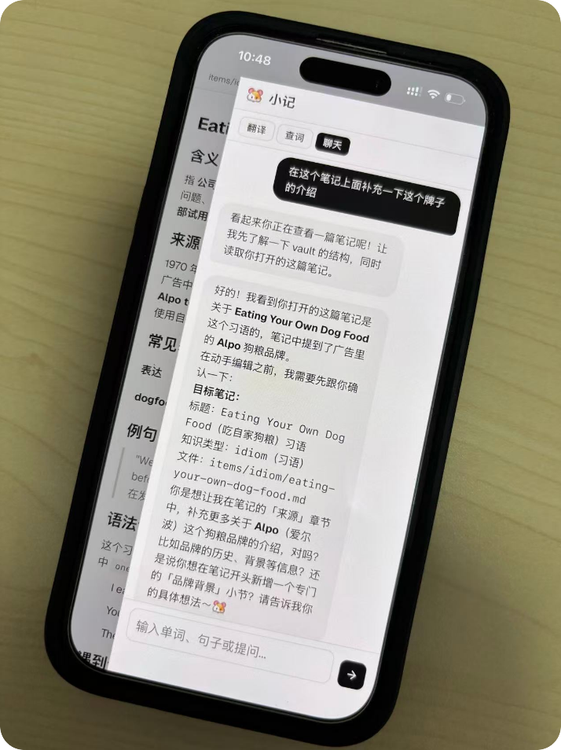

# 🎉 EverLingo v0.1.0 发布！

经过几个月和 AI 一起打磨，**记了么（EverLingo）**终于迎来了第一个正式可用版本 —— **v0.1.0** 🚀

这是 EverLingo 的第一个里程碑。

> **记忆，需要场景才能加强；笔记，需要盘活才有价值。** 🐹

EverLingo 希望做的不只是一个 AI 聊天工具，而是一位**有记忆的 AI 外语老师**：它不仅回答你的问题，更能记住你的学习轨迹、沉淀你的知识，并陪伴你持续学习。

从最初的想法，到今天能够真正用于学习、记笔记和知识管理，EverLingo 已经具备了完整的基础能力。

---

# ✨ 亮点

## 📝 聪明的 AI 笔记

让 AI 真正参与记笔记，而不是只负责聊天。

### ✍️ Vibe Noting（氛围记笔记）

小记 Agent 能感知当前笔记编辑器的上下文。

只需选中一句话，就可以让它：

* 💡 进一步解释内容
* 📚 补充更多背景知识
* ✍️ 帮你续写、润色或完善笔记

AI 不再脱离上下文，而是真正成为你的共同创作者。

### 🔗 构建属于自己的知识网络

* 笔记之间支持双向超链接
* AI 回复中的笔记可直接点击跳转
* 让知识自然连接，而不是散落在不同页面

---

## 📱 更好的使用体验

EverLingo 不再只是一个桌面网页。

* 📱 全面优化移动端体验
* 🏠 支持安装为 **PWA（网页应用）**，添加到手机主屏即可像 App 一样快速启动
* 💬 新增微信接入引导，用户可自助完成微信绑定
* 🌍 支持多学习语言配置，一个账号即可管理多种语言的学习

学习记录可以真正做到随时记录、随时查询。

---

## 👥 多用户正式支持

EverLingo 已具备多人部署能力。

* 👤 多用户管理
* 🔐 用户密码认证。网页端和浏览器扩展端均支持
* 🐳 用户级容器隔离，数据与运行环境彼此独立

无论是个人、家庭，还是小团队，都可以拥有各自独立的 EverLingo。

---

## ⚙️ 更简单的部署

部署门槛进一步降低。

* 📦 Docker 一键容器化安装。已实测 amd64 Linux / arm64 Raspberry Pi 。 M 系列的 MacOS 理论可容器兼容
* 📖 完善安装文档
* 🚀 几分钟即可完成部署

希望更多人能够轻松搭建属于自己的 EverLingo。

---

# ❤️ 接下来

v0.1.0 标志着 EverLingo 从 **Demo** 正式迈入 **Usable（真正可用）** 阶段。

接下来会持续围绕 **「AI + 记忆 + 外语学习」** 打磨更多能力，包括：

* ☁️ 笔记备份与共享
* 🧩 更自由的小记 Agent 定制能力
* 📚 更强大的知识组织能力
* 🔁 更科学的记忆与复习系统
* 🤖 更多 AI 自动化能力
* 🖼️ 支持图片等多模态交互与笔记
* 🌐 更多平台与生态集成

未来，希望 EverLingo 不只是一个翻译工具，也不只是一个笔记软件，而是能够陪伴每个人长期学习的 AI 学习伙伴。

---

🙏 欢迎大家体验，也欢迎提出任何建议、想法或 Bug。

如果 EverLingo 对你有所帮助，也欢迎分享给身边同样喜欢学习语言、记录知识、折腾 AI 的朋友。

一起把 **「真正有记忆的 AI 外语老师」** 做出来。🚀

## 结语

完整的功能特性，见 [https://github.com/labilezhu/everlingo/tree/v0.1.0](https://github.com/labilezhu/everlingo/tree/v0.1.0)

<!-- AI 外教 EverLingo 0.1 - 记忆，需要场景才能加强；笔记，需要盘活才有价值 -->